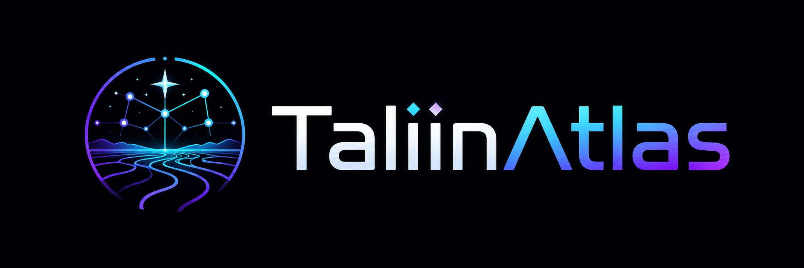
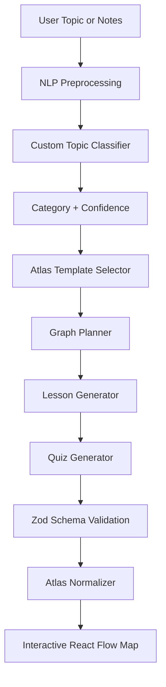
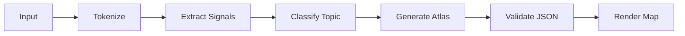
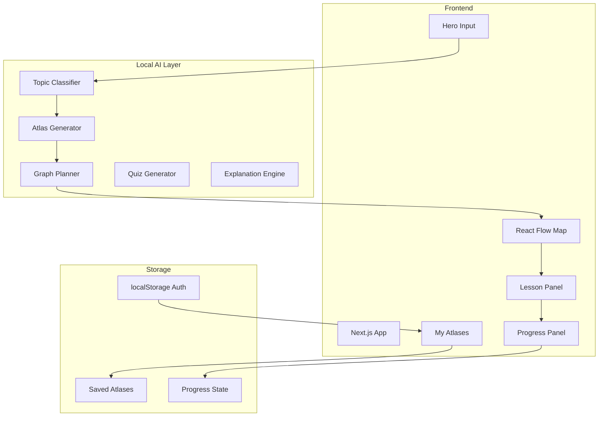
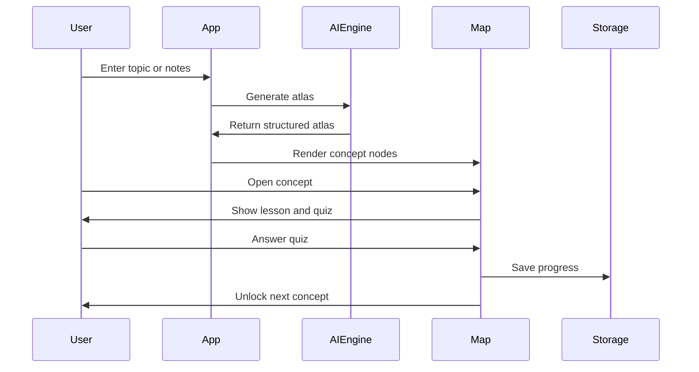

# 🌌 TaliinAtlas

> **Turn confusion into a map.**  
> TaliinAtlas transforms messy topics, notes, and learning goals into an explorable visual knowledge world where users learn concepts step by step.



---

## ✨ Overview

**TaliinAtlas** is a no-budget AI-powered learning map platform that helps learners understand complex topics visually.

Instead of reading long linear notes, users explore an interactive knowledge atlas made of connected concept nodes. Each node contains a mini lesson, example, quiz, and unlockable next steps.

As users learn, the map becomes clearer, new concepts unlock, and their progress grows.

---

## 🧠 Core Idea

Many students do not fail because they lack information.  
They fail because information is:

- unstructured
- overwhelming
- hard to prioritize
- difficult to connect
- boring to review
- not personalized to their level

**TaliinAtlas solves this by turning learning material into a visual prerequisite map.**

---

## 🚀 One-Line Pitch

> **TaliinAtlas turns confusing learning material into an explorable AI-generated knowledge map.**

---

## 🎯 Key Features

### 🗺️ Interactive Knowledge Map

Users can explore concepts as connected nodes.

- Locked nodes
- Available nodes
- Completed nodes
- Mastery nodes
- Dependency edges
- Visual learning path

---

### 🧩 Concept-Based Learning

Each concept node includes:

- short explanation
- practical example
- why it matters
- prerequisites
- quiz
- unlockable next steps

---

### 🔓 Quiz Unlock System

Users unlock new concepts by completing quizzes.

```txt
Read lesson → Answer quiz → Complete node → Unlock next concept
```

---

### 🌫️ Fog of Knowledge

Unknown concepts are visually hidden or dimmed.

As the user learns, the fog disappears and the map becomes clearer.

> The fog represents confusion.  
> Learning removes the fog.

---

### 📈 Progress Tracking

TaliinAtlas tracks:

- completed concepts
- unlocked concepts
- locked concepts
- mastery percentage
- next recommended concept

---

### 💾 Local Save System

Users can save generated atlases locally.

- Save current atlas
- Continue learning later
- Reopen saved atlases
- Track progress per atlas
- Local demo profile support

---

### 🧪 No-Budget Custom AI Engine

TaliinAtlas does **not require paid AI APIs**.

The MVP uses a local custom AI-style generation system designed for portfolio demonstration.

It can include:

- topic classification
- keyword/signal extraction
- template-based atlas generation
- graph planning
- quiz generation
- schema validation
- fallback atlas generation

---

## 🧠 AI Architecture

TaliinAtlas is designed as an AI-ready product, but the MVP works without OpenAI, Gemini, Claude, or any paid API.



---

## 🧬 Custom AI Engine Flow



Example:

```txt
Input:
Learn React Hooks

Detected Category:
React

Generated Concepts:
Components → JSX → Props → State → useState → useEffect → Custom Hooks → Mini Project
```

---

## 🏗️ System Architecture



---

## 🧱 Tech Stack

| Area | Technology |
| --- | --- |
| Framework | Next.js |
| Language | TypeScript |
| Styling | Tailwind CSS |
| Animation | Framer Motion |
| Map UI | React Flow |
| Validation | Zod |
| Storage | localStorage |
| AI Engine | Custom local ML/NLP-style engine |
| Auth | Local demo auth |
| Deployment | Vercel / GitHub Pages compatible depending on setup |

---

## 🎨 Visual Identity

TaliinAtlas uses a dark fantasy + futuristic learning dashboard style.

### Color Palette

| Purpose | Color |
| --- | --- |
| Background | `#070A12` |
| Card Background | `#111827` |
| Primary Purple | `#8B5CF6` |
| Cyan Accent | `#06B6D4` |
| Completed Green | `#22C55E` |
| Warning Orange | `#F59E0B` |
| Locked Gray | `#64748B` |
| Text | `#F8FAFC` |
| Muted Text | `#94A3B8` |

### Design Keywords

- glowing nodes
- dark background
- animated fog
- glassmorphism cards
- connected knowledge paths
- futuristic AI dashboard
- calm but game-like learning experience

---

## 🧭 User Flow



---

## 📦 Main Features

### Generate Learning Atlas

Users can enter:

```txt
Learn React Hooks
```

```txt
I want to understand Git, GitHub, branches, commits, and pull requests.
```

```txt
Learn JavaScript async await and promises.
```

TaliinAtlas generates a structured learning map.

---

### Concept Node Example

```json
{
  "id": "promises",
  "title": "Promises",
  "level": 2,
  "status": "available",
  "summary": "A Promise represents a future value.",
  "explanation": "Promises help handle asynchronous operations in JavaScript.",
  "example": "fetch('/api/user').then(res => res.json())",
  "prerequisites": ["callbacks"],
  "quizQuestion": "What does a Promise represent?",
  "quizOptions": [
    "A CSS style",
    "A future value",
    "A database table",
    "A browser event"
  ],
  "correctAnswer": "A future value",
  "unlocks": ["async-await"]
}
```

---

## 🧪 AI Lab

TaliinAtlas can include an AI Lab panel for debugging and portfolio demonstration.

AI Lab shows:

- input tokens
- detected topic category
- confidence score
- matched signals
- alternative categories
- model information
- generated atlas metadata

This proves that the project is not only a UI demo, but also has an explainable AI-style pipeline.

---

## 💾 Demo Auth Notice

TaliinAtlas uses localStorage-based demo authentication.

This is for portfolio/demo use only.

It supports:

- local register
- local login
- demo learner mode
- saved atlases per user
- progress persistence

It is **not production authentication**.

Future versions can replace this with:

- Supabase Auth
- Firebase Auth
- custom backend auth
- PostgreSQL database

---

## 🗂️ Suggested Project Structure

```txt
src/
  app/
    page.tsx
    layout.tsx
    api/
      ai/
        generate-atlas/
        classify/
        model-info/

  components/
    atlas/
      AtlasMap.tsx
      AtlasNode.tsx
      LessonPanel.tsx
      ProgressPanel.tsx

    auth/
      AuthModal.tsx
      LoginForm.tsx
      RegisterForm.tsx
      UserMenu.tsx

    library/
      MyAtlases.tsx
      SavedAtlasCard.tsx
      SaveAtlasButton.tsx

    ai/
      AIEngineBadge.tsx
      AIModelDebugPanel.tsx

  lib/
    ai/
      generateAtlas.ts
      atlasGenerator.ts
      atlasNormalizer.ts
      atlasSchema.ts
      quizGenerator.ts
      lessonGenerator.ts
      localExplanationEngine.ts

    ml/
      tokenizer.ts
      textNormalizer.ts
      featureExtractor.ts
      classifier.ts
      inference.ts

    auth/
      authService.ts
      authStorage.ts

    storage/
      savedAtlasStorage.ts
      progressStorage.ts

  data/
    atlasTemplates.ts
    trainingExamples.ts

  types/
    atlas.ts
    auth.ts
```

---

## ⚙️ Getting Started

### 1. Clone the repository

```bash
git clone https://github.com/BeBecpp/TaliinAtlas.git
cd TaliinAtlas
```

### 2. Install dependencies

```bash
npm install
```

### 3. Run development server

```bash
npm run dev
```

Open:

```txt
http://localhost:3000
```

---

## 🧪 Optional ML Training

If the custom ML training script exists:

```bash
npm run train:ml
```

Evaluate the model:

```bash
npm run evaluate:ml
```

---

## 🏗️ Build

```bash
npm run build
```

---

## 🧭 Demo Script

```txt
I start by entering a topic: “Learn async JavaScript.”

TaliinAtlas analyzes the topic and generates a visual learning map.

Each concept becomes a connected node.

I click on “Promises” and get a short lesson, example, and quiz.

After answering correctly, the next concept unlocks.

The fog disappears as I learn more.

Finally, I save the atlas and continue learning later.

TaliinAtlas turns confusion into a map.
```

---

## 📸 Screenshots

> Add screenshots here after UI is complete.

```txt
/public/screenshots/landing.png
/public/screenshots/atlas-map.png
/public/screenshots/lesson-panel.png
/public/screenshots/my-atlases.png
/public/screenshots/ai-lab.png
```

Example:

```md


```

---

## 🧠 Why This Project Matters

Most learning tools give users content.

TaliinAtlas gives users structure.

It helps answer:

- What should I learn first?
- What depends on what?
- What have I already mastered?
- What should I learn next?

The goal is to make self-learning feel like exploring a world instead of reading a long document.

---

## 🆚 Why Not Just Use an AI API?

This project intentionally avoids paid AI APIs for the MVP.

Instead of simply wrapping ChatGPT, TaliinAtlas demonstrates:

- local AI product architecture
- structured data generation
- topic classification
- graph-based learning design
- schema validation
- fallback systems
- interactive visual learning UX

This makes the project stronger as a portfolio piece because it shows engineering, not only API usage.

---

## 🔮 Future Improvements

- Real local LLM support with Ollama
- Supabase database
- Real authentication
- Public atlas sharing
- PNG map export
- Markdown study plan export
- Teacher dashboard
- Collaborative learning maps
- Voice explanation mode
- Multilingual lesson generation
- Spaced repetition review system

---

## 🧾 Portfolio Summary

**TaliinAtlas** is a no-budget AI learning-map generator built with Next.js, TypeScript, Tailwind CSS, React Flow, and a custom local AI-style engine.

It transforms messy learning topics into structured visual knowledge maps with lessons, quizzes, unlockable nodes, progress tracking, and saved learning worlds.

Unlike a simple chatbot wrapper, TaliinAtlas focuses on AI product architecture, graph-based learning, interactive UX, and explainable local generation.

---

## 🏷️ Tags

```txt
Next.js
TypeScript
React Flow
Tailwind CSS
Framer Motion
AI Engineering
No-Budget AI
Custom ML/NLP
Learning Platform
Knowledge Graph
Portfolio Project
```

---

## 📄 License

This project is created for learning, portfolio, and experimentation.

---

## 🌌 TaliinAtlas

> Explore knowledge like a living map.
